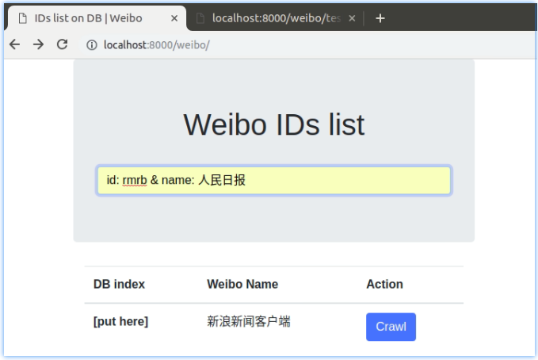
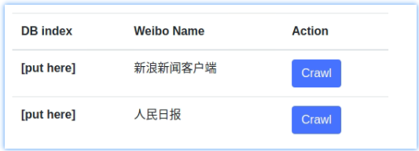

# Index Page of Weibo Application


## *Overview*

[TOC]


## 创建 Index 页面模板

新建 `GUI/web/weibo/templates/weibo/` 文件夹。

创建 `.../templates/weibo/index.html` 文件。

```html
{# web/weibo/templates/weibo/index.html #}
<!DOCTYPE html>
<html lang="en">
<head>
</head>
<body>
    <h1>Weibo IDs list</h1>
</body>
</html>
```

修改 `urls.py` :

```python
@@ -6,7 +6,7 @@ from . import views
 
 
 urlpatterns = [
-    path("", lambda request: HttpResponse("<h1>Hello Weibo App</h1>")),
+    path("", views.index, name="index"),
 
     path("crawler/", views.crawler, name="crawler"),
     path("test_crawler/", views.test_crawler, name="test_crawler"),
```

修改 `views.py`:

```python
from .models import Weibo, Seq2SeqPost

def index(request):
    return render(request, "weibo/index.html",
                  {}, )
```

浏览器刷新 http://localhost:8000/weibo/ 页面查看。

## 使用 bootstrap 以及渲染模板

### 引入 bootstrap 支持

```html
{# web/weibo/templates/weibo/index.html #}
<!DOCTYPE html>
<html lang="en">
<head>
    <!-- Required meta tags -->
    <meta charset="utf-8">
    <meta name="viewport" content="width=device-width, initial-scale=1, shrink-to-fit=no">

	<link rel="stylesheet" media="screen"
		  href="https://cdn.bootcss.com/bootstrap/4.0.0/css/bootstrap.min.css"
    	  integrity="sha384-Gn5384xqQ1aoWXA+058RXPxPg6fy4IWvTNh0E263XmFcJlSAwiGgFAW/dAiS6JXm"
		  crossorigin="anonymous">

	<script src="https://cdn.bootcss.com/jquery/3.2.1/jquery.slim.min.js"
	        integrity="sha384-KJ3o2DKtIkvYIK3UENzmM7KCkRr/rE9/Qpg6aAZGJwFDMVNA/GpGFF93hXpG5KkN"
	        crossorigin="anonymous"></script>
	<script src="https://cdn.bootcss.com/popper.js/1.12.9/umd/popper.min.js"
	        integrity="sha384-ApNbgh9B+Y1QKtv3Rn7W3mgPxhU9K/ScQsAP7hUibX39j7fakFPskvXusvfa0b4Q"
	        crossorigin="anonymous"></script>
	<script src="https://cdn.bootcss.com/bootstrap/4.0.0/js/bootstrap.min.js"
	        integrity="sha384-JZR6Spejh4U02d8jOt6vLEHfe/JQGiRRSQQxSfFWpi1MquVdAyjUar5+76PVCmYl"
	        crossorigin="anonymous"></script>

	<title>IDs list on DB | Weibo</title>
</head>
<body>
    [...]
```

上文 source 文件引入参考自 [Bootstrap4中文文档 :link:](https://v4.bootcss.com/)

### django 模板系统

line 20~25

```html
[...]
</head>
<body>
	<div class="container">
	<div class="row">
		<div class="col-md-12 push-md-4">
		<div class="text-center">
		<h1>Weibo IDs list</h1>
		</div></div>
	</div>
	<div class="row">
		<div class="col-md-12 push-md-4">
		<table name="id_list_table" id='id_list_table'
		       class="table table-hover">
		    <thead>
			<tr><th>DB index</th>
				<th>Weibo Name</th><th>Action</th></tr>
			</thead>
			<tbody>
		
			<tr><th scope="row">[put here]</th>
				<td>{{ each_weibo.weiboID }}</td>
				<td><input type="button" class="btn btn-primary" 
					       name="crawler" value="Crawl"></td></tr>
		
			</tbody>
		</table>
		</div>
	</div>
</body>
</html>
```

### `views.index` 渲染模板

```python
def index(request):
    return render(request, "weibo/index.html",
                  {'weibo_all_objects': Weibo.objects.all(), }, )
```

> 注意，如果 `Weibo` 数据库表中没有数据，则本处会有异常产生。
>
> 可以使用 `http://localhost:8000/weibo/test_crawler/` 这个 路径跑一下，爬取一次数据。后期修复了这个 bug，已经完善首页和爬取机制后，这个 url 会被删除。
>
> > 如果原本数据库 Weibo 表为空，使用上述路径跑了一下爬虫。则 Weibo表的 name 字段为空。因为目前该方法没有爬取该 ID 对应的微博网名。因此 `webo/` 的 index 页面 name 字段会为空。可以在 `python manage.py shell` 中手动修改。


## Crawler function

### function of `[Crawl]` button

增加 `[Crawl]` button 功能：

```html
[...]
			<tbody>
		
			<tr><th scope="row">[put here]</th>
				<td>{{ each_weibo.name }}</td>
				<td><input type="button" class="btn btn-primary" 
					       name="crawler" id="crawler" value="Crawl"
					       onclick="crawler('{{ each_weibo.name }}')"></td></tr>
		
			</tbody>
		</table>
		<script>
			function crawler(_name){
				alert("Crawl " + _name);
			}
		</script>
		</div>
```

为其增加一个 function 先做测试。


跳转到目前实现过的 `weibo/test_crawler/` url 来爬取测试 button 激活爬取数据功能。

```javascript
		<script>
			function crawler(_name){
				alert("Crawl " + _name);
				window.open("");
			}
		</script>
```


### new crawl target

#### `<input ...>` to add new target

在 Index 页面新增 input 输入框，输入用户 ID和 微博名（因为当前爬虫程序还没有识别页面中微博名的功能）来新增需要爬取的微博用户：

```html
[...]
<body>
	<div class="container">
	<div class="row">
		<div class="col-md-12 push-md-4 jumbotron">
		<div class="text-center">
		<h1>Weibo IDs list</h1>
		</div>
		<br/>

		<form method="POST" >
			<input id="id_new_crawl_target" name="new_crawl_target"
					placeholder="Enter an weibo id & name to be crawled"
					class="form-control input-lg">

			
		</form>
		</div>
	</div>
	<div class="row">
		<div class="col-md-12 push-md-4">
		<table name="id_list_table" id='id_list_table'
		       class="table table-hover">
[...]
```

:point_up_2: 增加输入框和外观。

#### handler add new target

为新增 new target 创建一个 url 路由：

```python
urlpatterns = [
    path("", views.index, name="index"),
    path("add/", views.add, name="add"),

    path("crawler/", views.crawler, name="crawler"),
    path("test_crawler/", views.test_crawler, name="test_crawler"),
]
```


修改 `views.py`  来处理 POST 过来的新增爬取用户请求：

```python
def add(request):
    if request.method == 'POST':
        data = request.POST.get("new_crawl_target", None)
        result = re.findall("^id: (.*) & name: (.*)$", data)
        if not request:
            return HttpResponse("wrong format")
        else:
            weiboID = result[0][0]
            weibo_name = result[0][1]
            try:
                Weibo.objects.create(weiboID=weiboID, name=weibo_name)
                new_target = Weibo.objects.get(weiboID=weiboID)
                return HttpResponse("<h1>ID: " + new_target.weiboID +
                                    "name: " + new_target.name + "</h1>")
            except Exception as err:
                print("Exception: ", err, file=sys.stderr)
                raise
```

在浏览器中输入 `id: <the id> & name: <the name>` 并按回车 POST 到后台得到响应：



回到 Index 页面刷新看到数据库中新增了该 target：



### Update `[Crawl]` button

之前刚好实现过了 `weibo/crawler/` 这个 url 作为一份测试，现在将 `[Crawl]` button 定位到请求这个 url，而非 `weibo/test_crawler/` 这个用于测试的 url：

```javascript
function crawler(_name){
    alert("Crawl " + _name);
    window.open("?name=" + _name);
}
```

现在修改 `views.crawler` 这个 function：

**原：**

```python
def crawler(request):
    return HttpResponse("<h1>you are in weibo -> crawler</h1>")
```

**现：**

```python
def crawler(request):
    if request.method == 'GET':
        _name = request.GET.get("name", None)
        if not _name:
            return HttpResponse("need specify name")
        try:
            _target = Weibo.objects.get(name=_name)
        except Weibo.DoesNotExist:
            return HttpResponse(
                "dose not exist this weibo name in DB, "
                "please add it on Index page, then request again")
        else:
            return HttpResponse(
                "<h1>crawl " + _target.name + "</h1>"
                "<p><strong>Please Finish this function!</strong></p>")
```

可以在首页点击 `[Crawl]` button 测试。


## Target Detail Page

### Page for Get One Post

增加一个 API (ex: `url/weibo/get/Seq2SeqPost/?weiboID=58371&index=1` ) 用于获取 post 内容。

```python
urlpatterns = [
    path("", views.index, name="index"),
    path("add/", views.add, name="add"),

    path("crawler/", views.crawler, name="crawler"),

    #
    # API
    #
    path("get/Seq2SeqPost/", views.get_seq2seqpost, name="get_seq2seqpost"),

    path("test_crawler/", views.test_crawler, name="test_crawler"),
]
```


实现该 API 的功能：

```python
def get_seq2seqpost(request):
    if request.method == "GET":
        try:
            _weiboID = request.GET["weiboID"]
            _index = request.GET["index"]

            _obj = Weibo.objects.get(weiboID=_weiboID).seq2seqpost_set.all()[int(_index)]
            return HttpResponse(
                "<h1>" + _obj.abstract + "</h1>" +
                "<p><i>" + _obj.hashtag + "</i></p>" +
                "<p>" + _obj.text + "</p>"
            )
        except TypeError:  # "_index" must be integer
            raise
        except IndexError:
            raise
        except Weibo.DoesNotExist:
            return HttpResponse("dose not exist")
        except Seq2SeqPost.DoesNotExist:
            raise
```


在浏览器输入如 

```
http://localhost:8000/weibo/get/Seq2SeqPost/?weiboID=58371&index=4
```

测试结果。


### Detail Page for show all Posts

`urls.py` :

```python
    path("<int:pk>/", views.detail, name="detail"),
```

`views.py` :

```python
from django.shortcuts import get_object_or_404

def detail(request, pk):
    weibo_obj = get_object_or_404(Weibo, pk=pk)
    try:
        return render(request, "weibo/detail.html",
                      {"weibo_obj": weibo_obj})
    except Exception:
        raise
```

add `detail.html` :

```html
{# web/weibo/templates/weibo/detail.html #}
<!DOCTYPE html>
<html lang="en">
<head>
    <!-- Required meta tags -->
    [...bootstrap resource...]

	<title>Weibo ID Detail | Weibo</title>
</head>
<body>
	<div class="container">
	<div class="row">
		<div class="col-md-12 push-md-4 jumbotron">
		<div class="text-center">
		<h1>{{ weibo_obj.name }}</h1>
		<input type="hidden" name="weibo_DB_id" value="{{ weibo_obj.id }}">
		</div>
		<br/>

		</div>
	</div>
	<div class="row">
	<div class="col-md-12 push-md-4">
		<div class="list-group">
		
			<a href="#" class="list-group-item list-group-item-action flex-column align-items-start">
				<div class="d-flex w-100 justify-content-between">
					<h5 class="mb-1">{{ seq2seqpost.abstract }}</h5>
					<small>{{ seq2seqpost.pub_date }}</small>
				</div>
				<small>{{ seq2seqpost.hashtag }}</small>
				<p class="mb-1">{{ seq2seqpost.body }}</p>
			</a>
		
		</div>
	</div>
	</div>
</body>
</html>
```

浏览器使用 `http://localhost:8000/weibo/1/` 即可查看。


修改 `index.html` 使可以跳转到 detail 页面：

```html
			<tr><th>DB index</th>
				<th>Weibo Name</th><th>Action</th></tr>
			</thead>
			<tbody>
		
			
			<tr><th scope="row">{{ each_weibo.id }}</th>
				<td><a href=""
					   class="">
				{{ each_weibo.name }}</a>
				</td>
				<td><input type="button" class="btn btn-primary" 
					       name="crawler" id="crawler" value="Crawl"
					       onclick="crawler('{{ each_weibo.name }}')"></td>
			</tr>
		
			</tbody>
```

注意到 line 8 用法，现在使用 app name + url name 来反向解析。

需要注册 "weibo" app name:

```python
app_name = 'weibo'
urlpatterns = [
    path("", views.index, name="index"),
    path("add/", views.add, name="add"),
    [...]
```

现在在 index 页面点击 “Weibo Name” 即可跳转到该 weibo id 的 detail page。

## Reference

N/A

